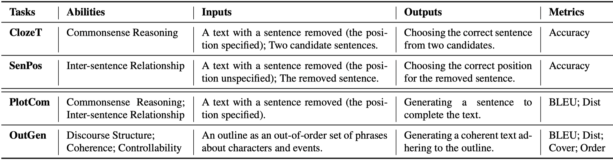
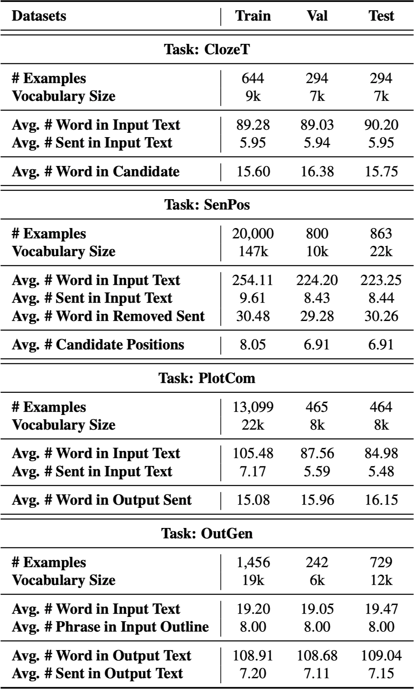
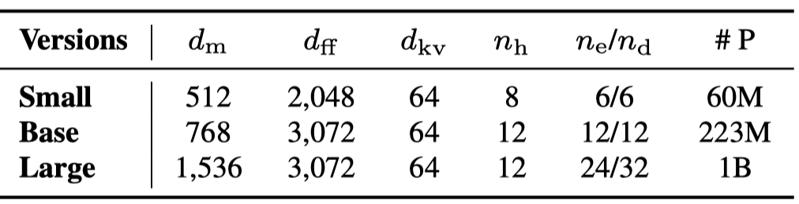

# LOT: A Benchmark for Evaluating Chinese Long Text Understanding and Generation

 

[Tasks](#tasks) | [Datasets](#datasets) | [LongLM](#longlm) | [Baselines](#baselines) | [Paper](https://arxiv.org/abs/2108.12960)

 

## Introduction

LOT is a benchmark for evaluating Chinese long text modeling. LOT consists of two understanding tasks and two generation tasks. We construct new datasets for these tasks based on human-written Chinese stories. 

Furthermore, we release an encoder-decoder-based Chinese long text pretraining model named LongLM with up to 1 billion parameters. We pretrain LongLM on 120G Chinese novels with two generative tasks including text infilling and conditional continuation. Extensive experiments show that LongLM outperforms similar-sized pretraining models substantially on both the understanding and generation tasks in LOT.


## Tasks

We design LOT as an aggregation of two understanding tasks including Cloze Test (ClozeT) and Sentence Position Prediction (SenPos), and two generation tasks including Plot Completion (PlotCom) and Outline-conditioned Generation (OutGen). We show the task descriptions in the table below.



### 

## Datasets

We show the data statistics in the table below. The abbreviation **sent**/**len** is short for **sentence**/**length**, respectively.  The datasets and evaluation scripts can be downloaded from [THUCloud](https://cloud.tsinghua.edu.cn/d/0cf033b0c7c049be855d/).




## LongLM

### 1. Parameters



- $d_m$: the dimension of hidden states
- $d_{ff}$: the dimension of feed forward layers
- $d_{kv}$: the dimension of  the keys/values in the self-attention layers
- $n_h$: the number of attention heads
- $n_e$: the number of hidden layers of the encoder
- $n_d$: the number of hidden layers of the decoder
- \#P: the number of parameters

### 2. Pretraining Tasks


### 3. Pretraining Data

We collect 120G novels as the pretraining data for LongLM. The pretraining data will be publicly available soon.

### 4. Checkpoints

1. **Download:** The checkpoints and example data can be downloaded from [THUCloud](https://cloud.tsinghua.edu.cn/d/576f340a43964a23b1a5/). The training and generation scripts are under the directory `longlm`. You can also use the [official script](https://github.com/huggingface/transformers/tree/v4.6.0-release/examples/legacy/seq2seq) provided by Transformers to fine-tune the model.

2. **Model Loading:** 

   ```python\
   from transformers import T5Tokenizer, T5ForConditionalGeneration
   tokenizer = T5Tokenizer.from_pretrained('LongLM-large')
   model = T5ForConditionalGeneration.from_pretrained('LongLM-large')
   ```

   - Dependencies: torch=1.8.1, transformers=4.6.1

3. **Training:**

   Execute `bash ./finetune.sh` to fine-tune LongLM. If deepspeed is available, you can execute `bash ./finetune_deepspped.sh` to accelerate.

   ```shell
   env CUDA_VISIBLE_DEVICES=0,1,2,3,4,5,6,7 CUDA_LAUNCH_BLOCKING=1 python3 -m torch.distributed.launch --nproc_per_node=8 \
   finetune_trainer.py \
   --data_dir=./data \ # directory of data
   --train_name=train \ # file prefix of the training data
   --output_dir=./save_model \ # output directory to save the checkpoint
   --save_total_limit=10 \ # maximum number of the saved checkpoints
   --per_gpu_train_batch_size=3 \ # batch size for training
   --per_gpu_eval_batch_size=3 \ # batch size for evaluation
   --num_train_epochs=1 \ # number of training epochs
   --logging_steps=5 \ # number of stps to log the loss value
   --model_name_or_path=./LongLM-small \ # path to the pretrained model
   --warmup_steps=100 \ # number of steps for warmup
   --learning_rate=1e-4 \ # learning rate
   --n_val=100 \ # number of examples for validation
   --do_train --do_eval \ # whether to training/validation
   --evaluation_strategy steps \ # strategy of evaluation
   --gradient_accumulation_steps=40 # number of steps for gradient accumulation
   --overwrite_output_dir \
   --load_best_model_at_end
   ```

4. **Generation:**

   ```python
   input_ids = tokenizer("小咕噜对，<extra_id_1>",return_tensors="pt", padding=True, truncation=True, max_length=512).input_ids.to(device)
   
   gen = model.generate(input_ids, do_sample=True, decoder_start_token_id=1, top_p=0.9, max_length=512)
   ```

   

## Baselines

### 1. Understanding Tasks 

The example data, training and evaluation scripts of LongLM are under the directory `./baselines/understanding`. You can execute `bash ./finetune.sh` to fine-tune LongLM and execute `bash ./eval.sh` to evaluate the fine-tuned model.

### 2. Generation Tasks

The training script of LongLM for the generation tasks is the same as pretraining script. The generation script and example data can be found under `./baseline/generation`. You can execute `bash ./gen.sh` for generation.


## Citation

```txt
@misc{guan2021lot,
      title={LOT: A Benchmark for Evaluating Chinese Long Text Understanding and Generation}, 
      author={Jian Guan and Zhuoer Feng and Yamei Chen and Ruilin He and Xiaoxi Mao and Changjie Fan and Minlie Huang},
      year={2021},
      eprint={2108.12960},
      archivePrefix={arXiv},
      primaryClass={cs.CL}
}
```

